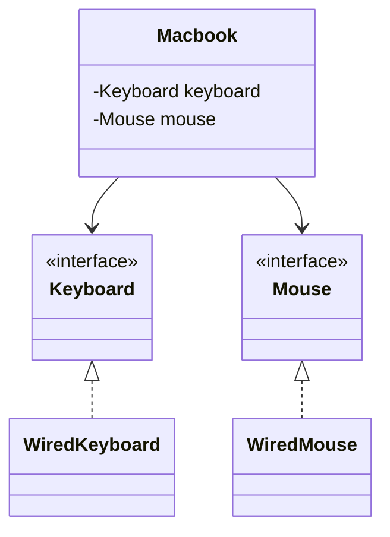

# Dependency Inversion Principle (DIP)

## Definition
> High-level modules should not depend on low-level modules.  
> Both should depend on **abstractions** (interfaces).  
> Abstractions should not depend on details, but details should depend on abstractions.

---

## ❌ Original Implementation (DIP Violation)

```java
class WiredKeyboard {
    public WiredKeyboard() {
        System.out.println("Wired Keyboard connected");
    }
}

class WiredMouse {
    public WiredMouse() {
        System.out.println("Wired Mouse connected");
    }
}

class Macbook {
    private final WiredKeyboard keyboard;
    private final WiredMouse mouse;

    public Macbook() {
        this.keyboard = new WiredKeyboard();
        this.mouse = new WiredMouse();
    }
}
```

### 🚨 Problem
- `Macbook` is tightly coupled with **concrete classes** `WiredKeyboard` and `WiredMouse`.  
- If we want to switch to `WirelessKeyboard` or `BluetoothMouse`, we must **modify `Macbook`**.  
- This violates the **Dependency Inversion Principle**.

---

## ✅ Refactored Implementation (DIP Applied)

### Step 1 – Create Abstractions
```java
interface Keyboard { }

interface Mouse { }
```

### Step 2 – Make Macbook Depend on Abstractions
```java
class Macbook {
    private final Keyboard keyboard;
    private final Mouse mouse;

    public Macbook(Keyboard keyboard, Mouse mouse) {
        this.keyboard = keyboard;
        this.mouse = mouse;
    }
}
```

### Step 3 – Provide Implementations
```java
class WiredKeyboard implements Keyboard {
    public WiredKeyboard() {
        System.out.println("Wired Keyboard connected");
    }
}

class WiredMouse implements Mouse {
    public WiredMouse() {
        System.out.println("Wired Mouse connected");
    }
}
```

### Step 4 – Use Flexible Composition
```java
public class Main {
    public static void main(String[] args) {
        Keyboard keyboard = new WiredKeyboard();
        Mouse mouse = new WiredMouse();

        Macbook macbook = new Macbook(keyboard, mouse);
    }
}
```

---

## 🎯 Benefits
- `Macbook` is **decoupled** from specific keyboard/mouse implementations.  
- We can add new devices (`BluetoothKeyboard`, `GamingMouse`, etc.) **without modifying** `Macbook`.  
- High-level code (`Macbook`) depends on **interfaces**, not concrete details.  

---

## UML Class Diagram


---

✅ This design follows the **Dependency Inversion Principle (DIP)** by ensuring that high-level classes (`Macbook`) depend on abstractions, not concrete implementations.
