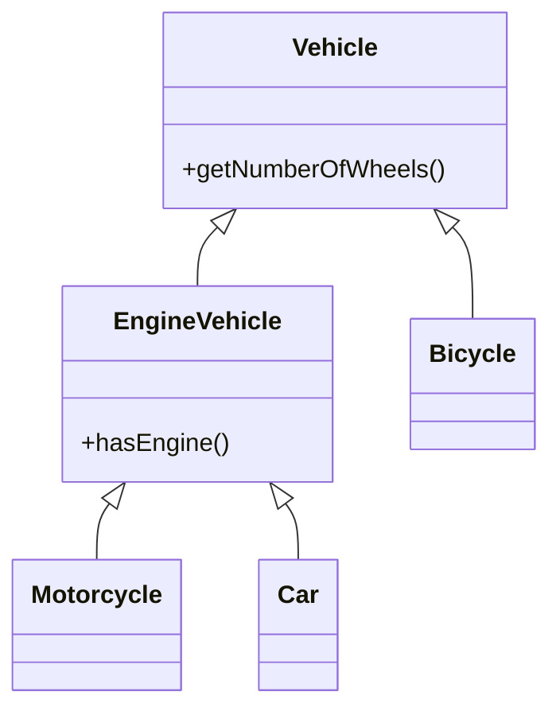

# Liskov Substitution Principle (LSP)

## Definition
> If class B is a subtype of class A, then we should be able to replace A with B without breaking the behavior of the program.  
> Subclasses should extend the capabilities of the parent class, not narrow them down.

In other words: Any instance of a parent class should be replaceable with an instance of a child class **without affecting correctness**.

---

## ❌ Original Implementation (LSP Violation)

```java
class Vehicle {
    public Integer getNumberOfWheels() {
        return 2;
    }

    public boolean hasEngine() {
        return true;
    }
}

class Motorcycle extends Vehicle { }

class Car extends Vehicle {
    @Override
    public Integer getNumberOfWheels() {
        return 4;
    }
}

class Bicycle extends Vehicle {
    @Override
    public boolean hasEngine() {
        return false; // Bicycles do not have engines
    }
}

public class Main {
    public static void main(String[] args) {
        List<Vehicle> vehicles = new ArrayList<>();
        vehicles.add(new Motorcycle());
        vehicles.add(new Car());
        vehicles.add(new Bicycle());

        for (Vehicle vehicle : vehicles) {
            System.out.println("Has engine: " + vehicle.hasEngine().toString());
            // ❌ Causes unexpected behavior (null pointer risk / wrong logic for Bicycle)
        }
    }
}
```

### 🚨 Problem
- `Bicycle` overrides `hasEngine()` to return `false`.  
- Code expecting `Vehicle.hasEngine()` to always be `true` **breaks**.  
- `Bicycle` cannot be safely substituted for `Vehicle` → **violates LSP**.

---

## ✅ Refactored Implementation (LSP Applied)

### Step 1 – Separate Engine Vehicles from Non-Engine Vehicles
```java
class Vehicle {
    public Integer getNumberOfWheels() {
        return 2;
    }
}

class EngineVehicle extends Vehicle {
    public boolean hasEngine() {
        return true;
    }
}
```

### Step 2 – Extend Appropriately
```java
class Motorcycle extends EngineVehicle { }

class Car extends EngineVehicle {
    @Override
    public Integer getNumberOfWheels() {
        return 4;
    }
}

class Bicycle extends Vehicle { }
```

### Step 3 – Safe Usage
```java
public class Main {
    public static void main(String[] args) {
        List<EngineVehicle> vehicles = new ArrayList<>();
        vehicles.add(new Motorcycle());
        vehicles.add(new Car());
        // vehicles.add(new Bicycle()); // ❌ Compile-time error

        for (EngineVehicle vehicle : vehicles) {
            System.out.println("Has engine: " + vehicle.hasEngine());
        }
    }
}
```

---

## 🎯 Benefits
- `Bicycle` no longer incorrectly overrides `hasEngine()`.  
- Engine-powered and non-engine vehicles are **properly separated**.  
- Substitution works without breaking correctness → **adheres to LSP**.

---

## UML Class Diagram


---

✅ This design follows the **Liskov Substitution Principle (LSP)** by ensuring that child classes can substitute their parents **without breaking program behavior**.
