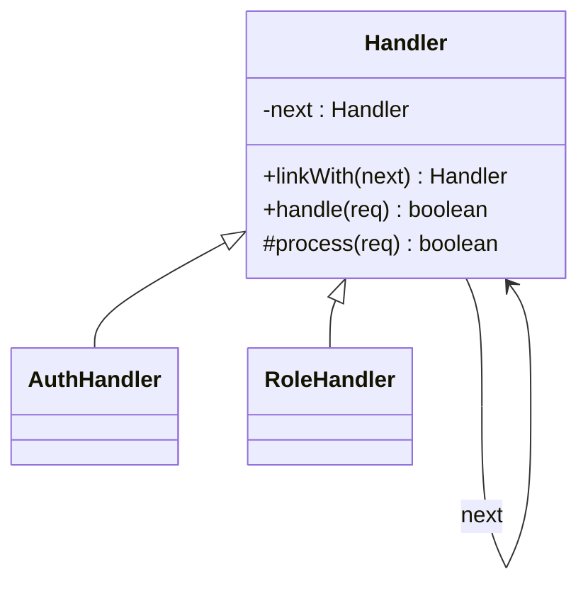

# Chain of Responsibility Design Pattern

## Definition
> The **Chain of Responsibility Pattern** passes a request along a chain of handlers. Each handler decides either to process the request or pass it to the next handler.

---

## ✅ Key Characteristics
- Avoids coupling the sender to a specific receiver.  
- Supports **flexible ordering** and dynamic composition of handlers.  
- Each handler focuses on a **single responsibility**.  

---

## ❌ Problem Without Chain
Big `if-else` sequences tightly couple request flow to concrete handlers, making changes risky and hard to test.

---

## ✅ Chain Solution

### Handler
```java
public abstract class Handler {
    private Handler next;
    public Handler linkWith(Handler next){ this.next = next; return next; }
    public boolean handle(String req){
        if (!process(req)) return false;
        if (next == null) return true;
        return next.handle(req);
    }
    protected abstract boolean process(String req);
}
```

### Concrete Handlers
```java
public class AuthHandler extends Handler {
    protected boolean process(String req){ 
        System.out.println("Auth OK for " + req); return true; 
    }
}

public class RoleHandler extends Handler {
    protected boolean process(String req){ 
        System.out.println("Role OK for " + req); return true; 
    }
}
```

### Client
```java
public class App {
    public static void main(String[] args) {
        Handler chain = new AuthHandler();
        chain.linkWith(new RoleHandler());
        chain.handle("request#1");
    }
}
```

---

## 🔎 Explanation
- `handle()` enforces the pipeline; `process()` is implemented by each handler.  
- Handlers can stop the chain by returning `false`.  

---

## 🎯 When to Use
- Validation pipelines, middleware stacks, event processing.  

---

## UML Class Diagram

---

✅ The **Chain of Responsibility Pattern** builds flexible pipelines of responsibility.
