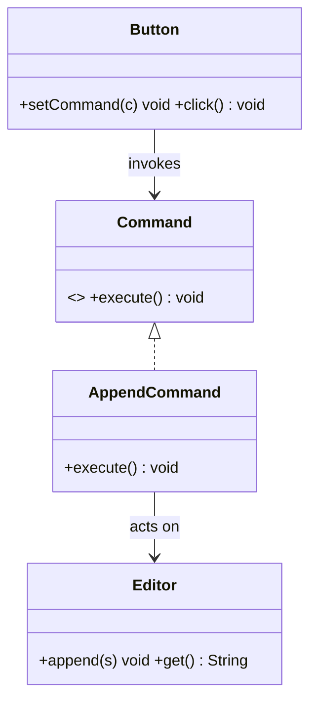

# Command Design Pattern

## Definition
> The **Command Pattern** encapsulates a request as an object, letting you parameterize clients, queue or log requests, and support undoable operations.

---

## ✅ Key Characteristics
- Decouples **invoker** from **receiver** via a command interface.  
- Supports **undo/redo**, **queuing**, and **logging**.  
- Macro commands compose multiple commands.  

---

## ❌ Problem Without Command
UI buttons directly call receivers, making it hard to add undo/history and reuse actions.

---

## ✅ Command Solution

### Command Interface
```java
public interface Command { void execute(); }
```

### Receiver
```java
public class Editor {
    private StringBuilder text = new StringBuilder();
    public void append(String s){ text.append(s); }
    public String get(){ return text.toString(); }
}
```

### Concrete Command
```java
public class AppendCommand implements Command {
    private final Editor editor; private final String s;
    public AppendCommand(Editor editor, String s){ this.editor = editor; this.s = s; }
    public void execute(){ editor.append(s); }
}
```

### Invoker
```java
public class Button {
    private Command command;
    public void setCommand(Command command){ this.command = command; }
    public void click(){ if (command != null) command.execute(); }
}
```

### Client
```java
public class App {
    public static void main(String[] args) {
        Editor editor = new Editor();
        Button button = new Button();
        button.setCommand(new AppendCommand(editor, "Hello "));
        button.click();
        button.setCommand(new AppendCommand(editor, "World"));
        button.click();
        System.out.println(editor.get()); // Hello World
    }
}
```

---

## 🔎 Explanation
- Invoker (`Button`) knows only about `Command`, not the receiver.  
- Commands can store state to support **undo/redo** (not shown).  

---

## 🎯 When to Use
- Menu items, toolbar buttons, task queues, transaction logs.  

---

## UML Class Diagram

---

✅ The **Command Pattern** turns requests into first-class objects.
