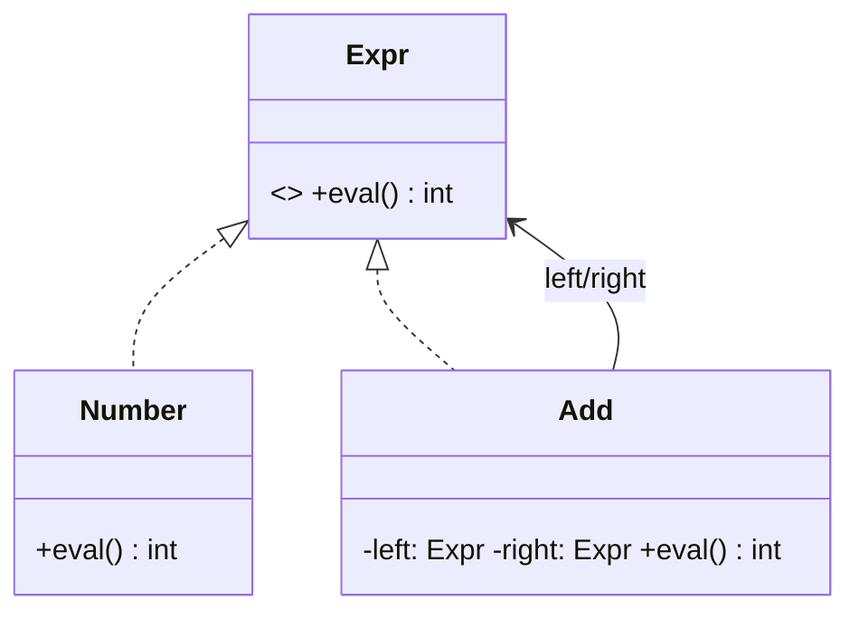

# Interpreter Design Pattern

## Definition
> The **Interpreter Pattern** defines a representation for a language’s grammar and an interpreter that uses this representation to interpret sentences in the language.

---

## ✅ Key Characteristics
- Encodes grammar rules in a class hierarchy.  
- Evaluates expressions by recursively interpreting the AST.  
- Useful for small DSLs; larger grammars favor parser generators.  

---

## ✅ Interpreter Solution

### Expression Interface & Terminals
```java
public interface Expr { int eval(); }

public class Number implements Expr {
    private final int value;
    public Number(int value){ this.value = value; }
    public int eval(){ return value; }
}
```

### Non-Terminal
```java
public class Add implements Expr {
    private final Expr left, right;
    public Add(Expr left, Expr right){ this.left = left; this.right = right; }
    public int eval(){ return left.eval() + right.eval(); }
}
```

### Client
```java
public class App {
    public static void main(String[] args) {
        Expr expr = new Add(new Number(2), new Add(new Number(3), new Number(4)));
        System.out.println(expr.eval()); // 9
    }
}
```

---

## 🔎 Explanation
- AST nodes implement `Expr` and evaluate recursively.  

---

## 🎯 When to Use
- Small, stable grammars (configuration, formulas, simple rules).  

---

## UML Class Diagram

---

✅ The **Interpreter Pattern** models and evaluates simple languages.
