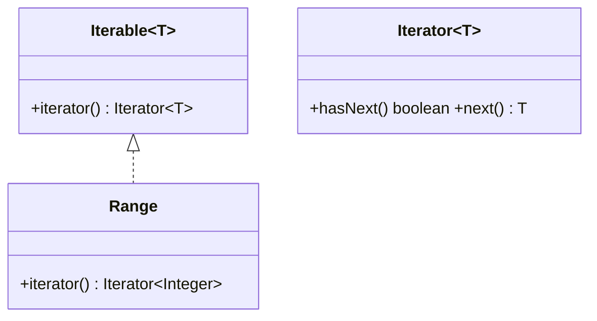

# Iterator Design Pattern

## Definition
> The **Iterator Pattern** provides a way to access elements of a collection sequentially without exposing its underlying representation.

---

## ✅ Key Characteristics
- Encapsulates traversal logic in a separate iterator object.  
- Multiple iterators can traverse independently.  
- Keeps collections’ internals hidden.  

---

## ✅ Iterator Solution (Java style)
```java
import java.util.Iterator;
import java.util.NoSuchElementException;

public class Range implements Iterable<Integer> {
    private final int start, end;
    public Range(int start, int end){ this.start = start; this.end = end; }
    public Iterator<Integer> iterator(){
        return new Iterator<>() {
            private int cur = start;
            public boolean hasNext(){ return cur <= end; }
            public Integer next(){
                if(!hasNext()) throw new NoSuchElementException();
                return cur++;
            }
        };
    }
}

public class App {
    public static void main(String[] args) {
        for (int x : new Range(1, 3)) {
            System.out.println(x);
        }
    }
}
```

---

## 🔎 Explanation
- `Range` hides representation; clients use enhanced-for with `Iterable`.  

---

## 🎯 When to Use
- Custom traversal orders; safe multi-iteration; hiding structure.  

---

## UML Class Diagram

---

✅ The **Iterator Pattern** separates traversal from collection storage.
