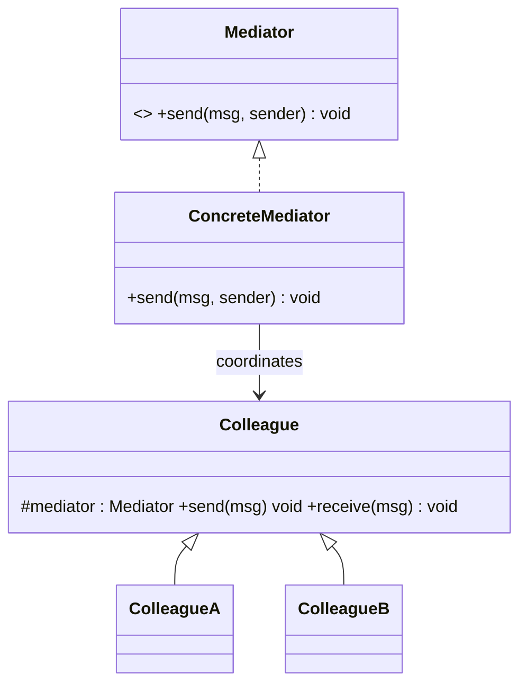

# Mediator Design Pattern

## Definition
> The **Mediator Pattern** defines an object that encapsulates how a set of objects interact. It promotes loose coupling by preventing objects from referring to each other explicitly.

---

## ✅ Key Characteristics
- Centralizes communication to reduce coupling.  
- Changes to interaction logic occur in the mediator, not colleagues.  
- Simplifies complex many-to-many relationships.  

---

## ❌ Problem Without Mediator
Colleagues talk to each other directly, creating a web of dependencies that’s hard to maintain.

---

## ✅ Mediator Solution

### Mediator & Colleagues
```java
public interface Mediator { void send(String msg, Colleague sender); }

public abstract class Colleague {
    protected Mediator mediator;
    public Colleague(Mediator mediator){ this.mediator = mediator; }
    public void send(String msg){ mediator.send(msg, this); }
    public abstract void receive(String msg);
}

public class ConcreteMediator implements Mediator {
    private Colleague a, b;
    public void registerA(Colleague c){ a = c; }
    public void registerB(Colleague c){ b = c; }
    public void send(String msg, Colleague sender){
        if(sender == a) b.receive(msg); else a.receive(msg);
    }
}
```

### Concrete Colleagues
```java
public class ColleagueA extends Colleague {
    public ColleagueA(Mediator m){ super(m); }
    public void receive(String msg){ System.out.println("A got: " + msg); }
}

public class ColleagueB extends Colleague {
    public ColleagueB(Mediator m){ super(m); }
    public void receive(String msg){ System.out.println("B got: " + msg); }
}
```

### Client
```java
public class App {
    public static void main(String[] args) {
        ConcreteMediator m = new ConcreteMediator();
        ColleagueA a = new ColleagueA(m);
        ColleagueB b = new ColleagueB(m);
        m.registerA(a); m.registerB(b);
        a.send("Hello B");
        b.send("Hello A");
    }
}
```

---

## 🔎 Explanation
- `ConcreteMediator` routes messages and can implement complex rules.  
- Colleagues no longer depend on each other directly.  

---

## 🎯 When to Use
- Chat rooms, UI dialog coordination, air traffic control.  

---

## UML Class Diagram

---

✅ The **Mediator Pattern** keeps object interactions clean and centralized.
