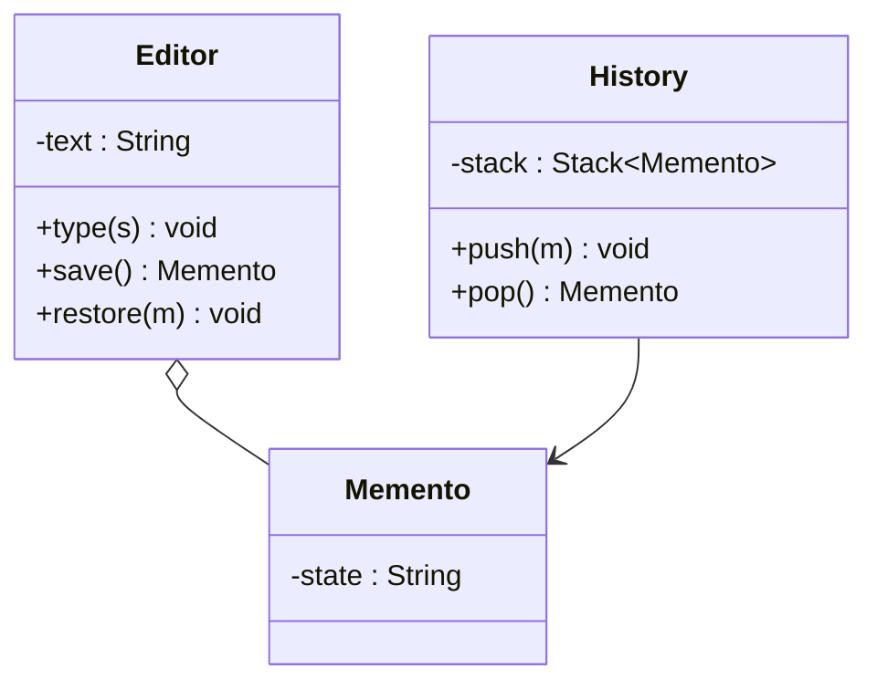

# Memento Design Pattern

## Definition
> The **Memento Pattern** captures and externalizes an object’s internal state so that it can be restored later, without violating encapsulation.

---

## ✅ Key Characteristics
- Saves and restores state safely.  
- Originator, Memento, and Caretaker roles.  
- Mementos are opaque to clients (encapsulation preserved).  

---

## ✅ Memento Solution

### Originator & Memento
```java
public class Editor {
    private String text = "";
    public void type(String s){ text += s; }
    public String getText(){ return text; }

    public Memento save(){ return new Memento(text); }
    public void restore(Memento m){ this.text = m.state; }

    public static class Memento {
        private final String state;
        private Memento(String state){ this.state = state; }
    }
}
```

### Caretaker
```java
import java.util.Stack;

public class History {
    private final Stack<Editor.Memento> stack = new Stack<>();
    public void push(Editor.Memento m){ stack.push(m); }
    public Editor.Memento pop(){ return stack.pop(); }
}
```

### Client
```java
public class App {
    public static void main(String[] args) {
        Editor editor = new Editor();
        History history = new History();

        editor.type("Hello ");
        history.push(editor.save());
        editor.type("World!");
        System.out.println(editor.getText()); // Hello World!

        editor.restore(history.pop());
        System.out.println(editor.getText()); // Hello 
    }
}
```

---

## 🔎 Explanation
- `Memento` holds state; only `Editor` (originator) can read it.  
- `History` (caretaker) stores mementos without inspecting contents.  

---

## 🎯 When to Use
- Undo/redo, checkpoints, transactional rollbacks.  

---

## UML Class Diagram

---

✅ The **Memento Pattern** powers undo/redo while keeping state private.
