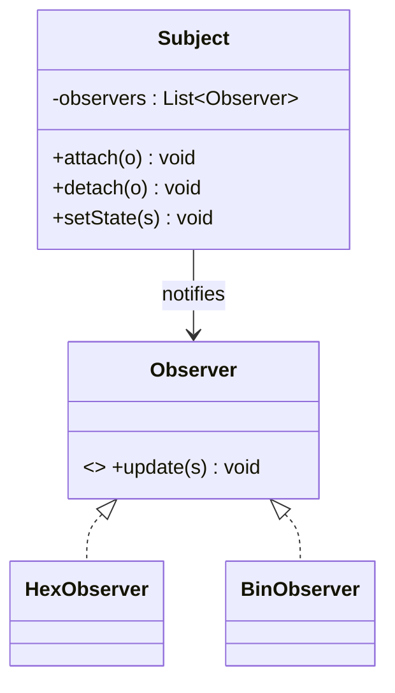

# Observer Design Pattern

## Definition
> The **Observer Pattern** defines a one-to-many dependency so that when one object changes state, all its dependents are notified and updated automatically.

---

## ✅ Key Characteristics
- Loose coupling between **Subject** and **Observers**.  
- Supports many subscribers; dynamic subscribe/unsubscribe.  
- Great for event-driven systems and GUIs.  

---

## ✅ Observer Solution

### Subject
```java
import java.util.ArrayList;
import java.util.List;

public class Subject {
    private final List<Observer> observers = new ArrayList<>();
    private int state;
    public void attach(Observer o){ observers.add(o); }
    public void detach(Observer o){ observers.remove(o); }
    public void setState(int s){ state = s; notifyAllObs(); }
    public void notifyAllObs(){ observers.forEach(o -> o.update(state)); }
}
```

### Observer
```java
public interface Observer { void update(int newState); }
```

### Concrete Observers
```java
public class HexObserver implements Observer {
    public void update(int s){ System.out.println("Hex: " + Integer.toHexString(s)); }
}
public class BinObserver implements Observer {
    public void update(int s){ System.out.println("Bin: " + Integer.toBinaryString(s)); }
}
```

### Client
```java
public class App {
    public static void main(String[] args) {
        Subject subject = new Subject();
        subject.attach(new HexObserver());
        subject.attach(new BinObserver());
        subject.setState(15);
    }
}
```

---

## 🔎 Explanation
- Observers register with the subject and receive push notifications on changes.  

---

## 🎯 When to Use
- Event buses, GUIs, reactive streams, model-view synchronization.  

---

## UML Class Diagram

---

✅ The **Observer Pattern** enables publish–subscribe communication.
