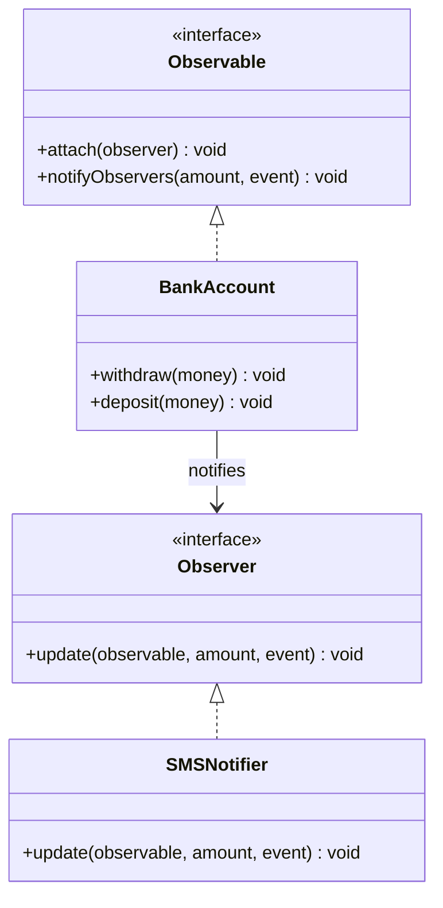

# Observer Design Pattern

## Definition
> The **Observer Pattern** defines a one-to-many dependency between objects so that when one object changes state, all its dependents are notified and updated automatically.

---

## ✅ Key Characteristics
- Loose coupling between **Subject (Observable)** and **Observers**.
- Supports dynamic **subscribe/unsubscribe**.
- Widely used in **event-driven systems**, **GUIs**, and **notifications**.

---

## ❌ Problem Without Observer
- The `BankAccount` would need to hardcode every notification mechanism (SMS, Email, Logging, etc.).
- Adding a new notifier means modifying the core `BankAccount` class — violating the **Open/Closed Principle**.

---

## ✅ Observer Solution (Bank Account Example in Java)

### Observable Interface
```java
public interface Observable {
    void attach(Observer observer);
    void notifyObservers(int amount, String event);
}
```

### Observer Interface
```java
public interface Observer {
    void update(Observable observable, int amount, String event);
}
```

### Concrete Observable
```java
import java.util.ArrayList;
import java.util.List;

public class BankAccount implements Observable {
    private final List<Observer> observers = new ArrayList<>();

    @Override
    public void attach(Observer observer) {
        observers.add(observer);
    }

    @Override
    public void notifyObservers(int amount, String event) {
        for (Observer obs : observers) {
            obs.update(this, amount, event);
        }
    }

    public void withdraw(int money) {
        notifyObservers(money, "MONEY_WITHDRAW");
    }

    public void deposit(int money) {
        notifyObservers(money, "MONEY_DEPOSIT");
    }
}
```

### Concrete Observer
```java
public class SMSNotifier implements Observer {
    @Override
    public void update(Observable observable, int amount, String event) {
        System.out.println("SMS: " + amount + " " + event);
    }
}
```

### Client
```java
public class App {
    public static void main(String[] args) {
        BankAccount account = new BankAccount();
        Observer smsNotifier = new SMSNotifier();

        account.attach(smsNotifier);

        account.withdraw(500);
        account.deposit(5000);
    }
}
```

**Output**
```
SMS: 500 MONEY_WITHDRAW
SMS: 5000 MONEY_DEPOSIT
```

---

## 🔎 Explanation
- `BankAccount` is the **Observable**, maintaining a list of observers.
- `SMSNotifier` is an **Observer**, reacting whenever `BankAccount` triggers an event.
- Adding more notifiers (e.g., EmailNotifier, AuditLogger) requires **no changes** to `BankAccount`.

---

## 🎯 When to Use
- Event handling in GUIs or real-time systems.
- Notification services (banking, trading, monitoring).
- Model-View synchronization (MVC).

---

## UML Class Diagram

---

✅ The **Observer Pattern** makes `BankAccount` extensible — new notification mechanisms can be plugged in without changing its code.
