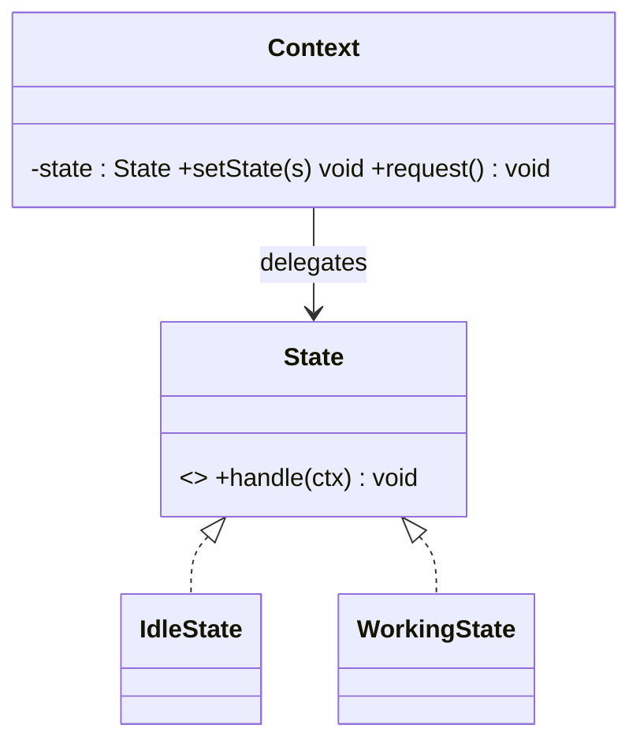

# State Design Pattern

## Definition
> The **State Pattern** lets an object alter its behavior when its internal state changes. The object will appear to change its class.

---

## ✅ Key Characteristics
- Encapsulates state-specific behavior into separate classes.  
- Eliminates large conditionals based on state.  
- Context delegates work to the current state object.  

---

## ✅ State Solution

### State Interface & Concrete States
```java
public interface State { void handle(Context ctx); }

public class IdleState implements State {
    public void handle(Context ctx){
        System.out.println("Idle -> Working");
        ctx.setState(new WorkingState());
    }
}

public class WorkingState implements State {
    public void handle(Context ctx){
        System.out.println("Working -> Idle");
        ctx.setState(new IdleState());
    }
}
```

### Context
```java
public class Context {
    private State state = new IdleState();
    public void setState(State s){ state = s; }
    public void request(){ state.handle(this); }
}
```

### Client
```java
public class App {
    public static void main(String[] args) {
        Context ctx = new Context();
        ctx.request(); // Idle -> Working
        ctx.request(); // Working -> Idle
    }
}
```

---

## 🔎 Explanation
- Each state knows how to transition and act; context just delegates.  

---

## 🎯 When to Use
- Finite-state machines, workflows, parsing.  

---

## UML Class Diagram

---

✅ The **State Pattern** organizes behavior around explicit states and transitions.
