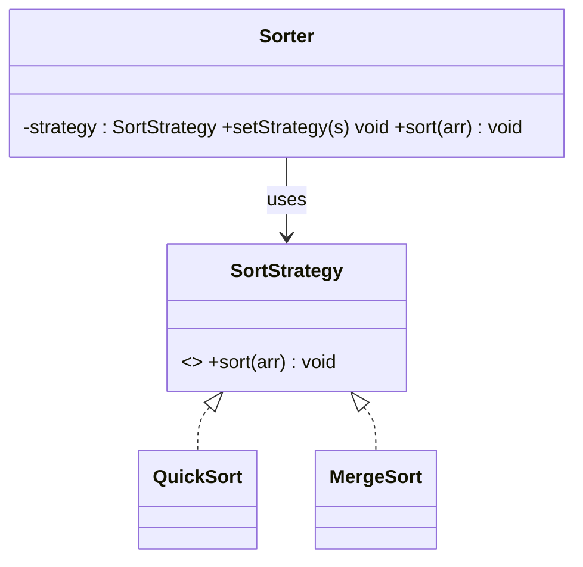

# Strategy Design Pattern

## Definition
> The **Strategy Pattern** defines a family of algorithms, encapsulates each one, and makes them interchangeable. Strategy lets the algorithm vary independently from clients that use it.

---

## ✅ Key Characteristics
- Encapsulates algorithms behind a **common interface**.  
- Swap strategies at **runtime**.  
- Avoids conditionals scattered across the codebase.  

---

## ✅ Strategy Solution

### Strategy Interface & Concrete Strategies
```java
public interface SortStrategy { void sort(int[] arr); }

public class QuickSort implements SortStrategy {
    public void sort(int[] arr){ System.out.println("QuickSort"); }
}

public class MergeSort implements SortStrategy {
    public void sort(int[] arr){ System.out.println("MergeSort"); }
}
```

### Context
```java
public class Sorter {
    private SortStrategy strategy;
    public Sorter(SortStrategy s){ this.strategy = s; }
    public void setStrategy(SortStrategy s){ this.strategy = s; }
    public void sort(int[] arr){ strategy.sort(arr); }
}
```

### Client
```java
public class App {
    public static void main(String[] args) {
        Sorter sorter = new Sorter(new QuickSort());
        sorter.sort(new int[]{3,1,2});
        sorter.setStrategy(new MergeSort());
        sorter.sort(new int[]{3,1,2});
    }
}
```

---

## 🔎 Explanation
- Strategies provide interchangeable algorithms adhering to one interface.  

---

## 🎯 When to Use
- Pluggable business rules, sorting/compression algorithms, route planning.  

---

## UML Class Diagram

---

✅ The **Strategy Pattern** lets you vary the algorithm without changing the client.
