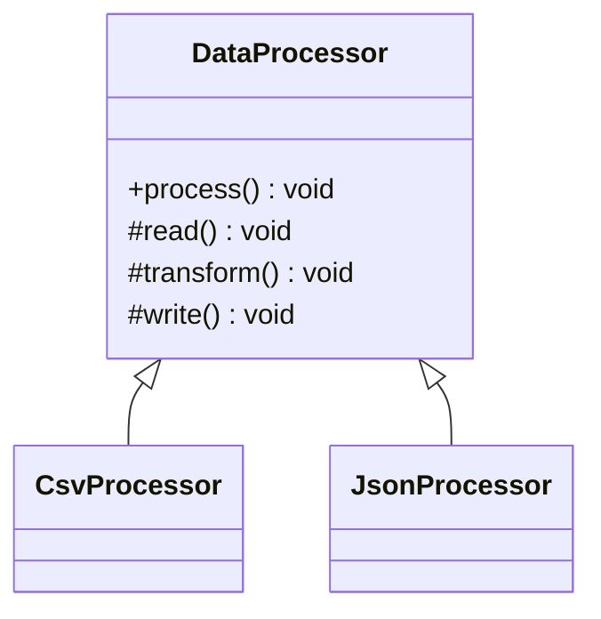

# Template Method Design Pattern

## Definition
> The **Template Method Pattern** defines the skeleton of an algorithm in a method, deferring some steps to subclasses.

---

## ✅ Key Characteristics
- Inversion of control: **base class** calls subclass hooks.  
- Enforces a **fixed workflow** with pluggable steps.  
- Reduces code duplication across similar algorithms.  

---

## ✅ Template Method Solution

### Abstract Class
```java
public abstract class DataProcessor {
    public final void process() {
        read();
        transform();
        write();
    }
    protected abstract void read();
    protected abstract void transform();
    protected abstract void write();
}
```

### Concrete Classes
```java
public class CsvProcessor extends DataProcessor {
    protected void read(){ System.out.println("Read CSV"); }
    protected void transform(){ System.out.println("Transform CSV"); }
    protected void write(){ System.out.println("Write CSV"); }
}

public class JsonProcessor extends DataProcessor {
    protected void read(){ System.out.println("Read JSON"); }
    protected void transform(){ System.out.println("Transform JSON"); }
    protected void write(){ System.out.println("Write JSON"); }
}
```

### Client
```java
public class App {
    public static void main(String[] args) {
        new CsvProcessor().process();
        new JsonProcessor().process();
    }
}
```

---

## 🔎 Explanation
- `process()` is the **template method**; subclasses implement steps.  

---

## 🎯 When to Use
- Similar workflows with minor variations (file parsers, request pipelines).  

---

## UML Class Diagram

---

✅ The **Template Method Pattern** standardizes workflows with overridable steps.
