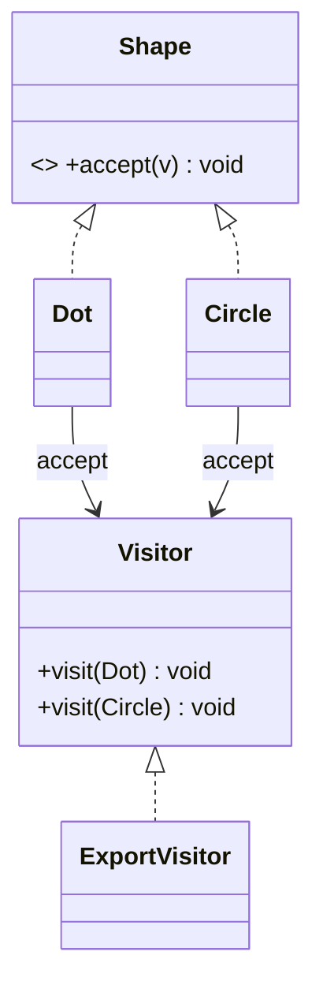

# Visitor Design Pattern

## Definition
> The **Visitor Pattern** lets you define new operations on a set of objects without changing the classes of the elements on which it operates.

---

## ✅ Key Characteristics
- Adds operations without modifying element classes.  
- Uses **double dispatch** (`element.accept(visitor)`).  
- Separates algorithms from data structures.  

---

## ✅ Visitor Solution

### Visitor & Elements
```java
public interface Visitor {
    void visit(Dot dot);
    void visit(Circle circle);
}

public interface Shape {
    void accept(Visitor v);
}

public class Dot implements Shape {
    public void accept(Visitor v){ v.visit(this); }
}

public class Circle implements Shape {
    public void accept(Visitor v){ v.visit(this); }
}
```

### Concrete Visitor
```java
public class ExportVisitor implements Visitor {
    public void visit(Dot d){ System.out.println("Export Dot"); }
    public void visit(Circle c){ System.out.println("Export Circle"); }
}
```

### Client
```java
public class App {
    public static void main(String[] args) {
        Shape[] shapes = { new Dot(), new Circle() };
        Visitor exporter = new ExportVisitor();
        for (Shape s : shapes) s.accept(exporter);
    }
}
```

---

## 🔎 Explanation
- `accept` triggers **double dispatch**, calling the correct `visit` overload.  

---

## 🎯 When to Use
- Adding operations frequently (serialization, metrics, rendering).  

---

## UML Class Diagram

---

✅ The **Visitor Pattern** cleanly adds operations across object structures.
