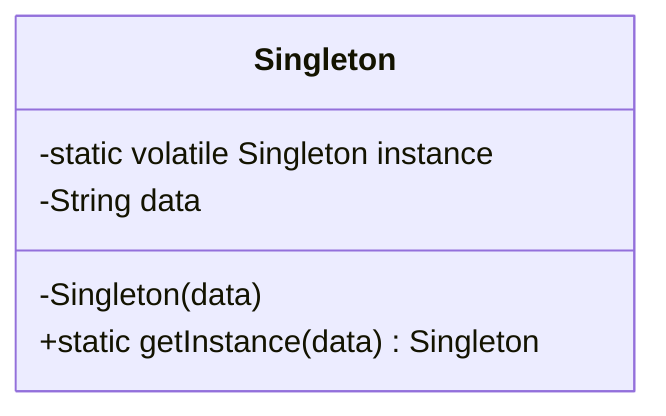

# Singleton Design Pattern

## Definition
> The **Singleton Pattern** ensures that only one instance of a class exists and provides a global point of access to that instance.

---

## ✅ Key Characteristics
- Guarantees that only one instance of the class will exist.  
- Provides a single point of access from anywhere in the application.  
- Disables all other means of creating objects outside the class.  
- Returns the existing instance if it already exists.  
- Needs thread-safety considerations in multi-threaded applications.  

---

## ❌ Basic (Non-Thread-Safe) Singleton Example
```java
public class Singleton {
    private static Singleton instance;
    private String data;

    private Singleton(String data) {
        this.data = data;
    }

    public static Singleton getInstance(String data) {
        if (instance == null) {
            instance = new Singleton(data);
        }
        return instance;
    }
}
```

### 🚨 Problem
- In a multi-threaded environment, two threads could simultaneously create different instances.  
- This breaks the singleton guarantee.

---

## ✅ Thread-Safe Singleton (Double-Checked Locking)
```java
public class Singleton {
    private static volatile Singleton instance; 
    private String data;

    // Private constructor prevents instantiation outside
    private Singleton(String data) {
        this.data = data;
    }

    public static Singleton getInstance(String data) {
        Singleton result = instance;
        if (result == null) {
            synchronized (Singleton.class) {
                result = instance;
                if (result == null) {
                    instance = result = new Singleton(data);
                }
            }
        }
        return instance;
    }
}
```

### Explanation
- **`volatile`**: Ensures visibility of changes to variables across threads.  
- **Double-checked locking**: Synchronization happens only when the instance is `null`, minimizing performance overhead.  
- Guarantees only one instance will be created even in a multi-threaded environment.  

---

## 🎯 When to Use
- When you need exactly one object to coordinate actions across a system.  
- For shared resources (logging, configuration management, caches, thread pools, etc.).  

---

## UML Class Diagram


---

✅ The **Singleton Design Pattern** ensures a single instance and global access, making it useful for managing shared resources safely.
