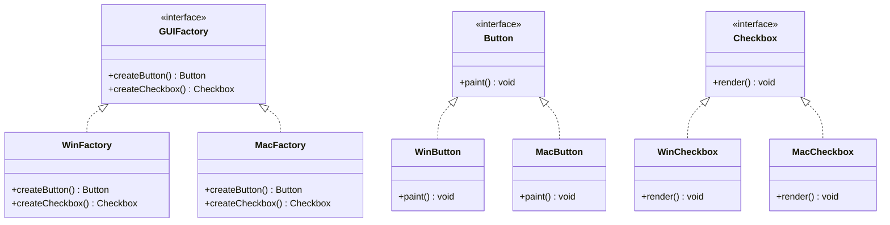

# Abstract Factory Design Pattern

## Definition
> The **Abstract Factory Pattern** provides an interface for creating **families of related objects** without specifying their concrete classes.

---

## ✅ Key Characteristics
- Produces **related products** that are meant to be used together.  
- Hides the concrete classes behind **abstract products** and **factories**.  
- Makes it easy to switch entire **product families**.  
- Supports the **Open/Closed Principle** (add a new family by creating a new factory).  

---

## ❌ Problem Without Abstract Factory
Client code directly instantiates concrete UI widgets (e.g., Windows vs. Mac), creating tight coupling and making it hard to switch the whole look & feel.

---

## ✅ Abstract Factory Solution

### Abstract Products
```java
public interface Button { void paint(); }
public interface Checkbox { void render(); }
```

### Concrete Products
```java
public class WinButton implements Button {
    public void paint() { System.out.println("Painting Windows Button"); }
}
public class MacButton implements Button {
    public void paint() { System.out.println("Painting Mac Button"); }
}

public class WinCheckbox implements Checkbox {
    public void render() { System.out.println("Rendering Windows Checkbox"); }
}
public class MacCheckbox implements Checkbox {
    public void render() { System.out.println("Rendering Mac Checkbox"); }
}
```

### Abstract Factory
```java
public interface GUIFactory {
    Button createButton();
    Checkbox createCheckbox();
}
```

### Concrete Factories
```java
public class WinFactory implements GUIFactory {
    public Button createButton() { return new WinButton(); }
    public Checkbox createCheckbox() { return new WinCheckbox(); }
}

public class MacFactory implements GUIFactory {
    public Button createButton() { return new MacButton(); }
    public Checkbox createCheckbox() { return new MacCheckbox(); }
}
```

### Client
```java
public class App {
    private final Button button;
    private final Checkbox checkbox;

    public App(GUIFactory factory) {
        this.button = factory.createButton();
        this.checkbox = factory.createCheckbox();
    }

    public void run() {
        button.paint();
        checkbox.render();
    }

    public static void main(String[] args) {
        GUIFactory factory = System.getProperty("os.name").startsWith("Windows")
                ? new WinFactory() : new MacFactory();
        new App(factory).run();
    }
}
```

---

## 🔎 Explanation
- The client depends only on **abstract types** (`Button`, `Checkbox`, `GUIFactory`).  
- To switch the **entire family**, use a different factory (e.g., `WinFactory` → `MacFactory`).  
- New families are introduced by **adding new factories** only.

---

## 🎯 When to Use
- You need to keep product families **consistent** (e.g., UI toolkits).  
- You must switch families **at runtime** (e.g., themes, platforms).  
- You want to avoid coupling the client to **concrete classes**.

---

## UML Class Diagram

---

✅ The **Abstract Factory Pattern** encapsulates the creation of related objects, enabling easy swaps of product families and cleanly decoupled client code.
