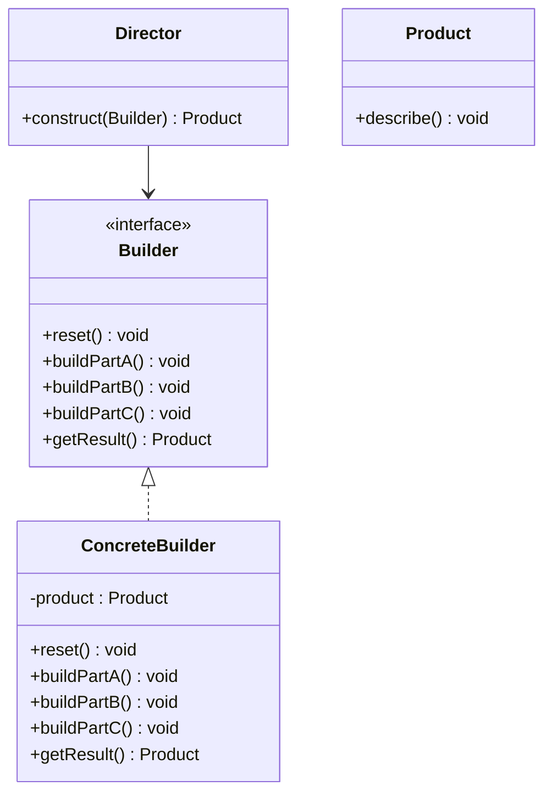

# Builder Design Pattern

## Definition
> The **Builder Pattern** separates object construction from its representation, allowing the same construction process to create different representations.

---

## ✅ Key Characteristics
- Builds complex objects **step by step**.  
- The construction process can **vary independently** from the final representation.  
- A **Director** can orchestrate the steps (optional).  
- Reduces telescoping constructors and improves readability.

---

## ❌ Problem Without Builder
Constructors with many optional parameters lead to unreadable code and invalid states.

---

## ✅ Builder Solution

### Product
```java
public class Product {
    private String partA;
    private String partB;
    private String partC;

    void setPartA(String a) { this.partA = a; }
    void setPartB(String b) { this.partB = b; }
    void setPartC(String c) { this.partC = c; }

    public void describe() {
        System.out.println("Product[A=" + partA + ", B=" + partB + ", C=" + partC + "]");
    }
}
```

### Builder Interface & Concrete Builder
```java
public interface Builder {
    void reset();
    void buildPartA();
    void buildPartB();
    void buildPartC();
    Product getResult();
}

public class ConcreteBuilder implements Builder {
    private Product product;

    public void reset() { product = new Product(); }
    public void buildPartA() { product.setPartA("PartA"); }
    public void buildPartB() { product.setPartB("PartB"); }
    public void buildPartC() { product.setPartC("PartC"); }
    public Product getResult() { return product; }
}
```

### Director (optional)
```java
public class Director {
    public Product construct(Builder builder) {
        builder.reset();
        builder.buildPartA();
        builder.buildPartB();
        builder.buildPartC();
        return builder.getResult();
    }
}
```

### Client
```java
public class App {
    public static void main(String[] args) {
        Director director = new Director();
        Builder builder = new ConcreteBuilder();
        Product product = director.construct(builder);
        product.describe();
    }
}
```

---

## 🔎 Explanation
- Builders **encapsulate construction steps** and hide internal representation.  
- The Director ensures **consistent sequences**; however, clients can also call steps directly.

---

## 🎯 When to Use
- Complex objects with many optional parts or configurations.  
- The construction algorithm should be independent from the final object’s type.  

---

## UML Class Diagram

---

✅ The **Builder Pattern** clarifies construction logic and keeps your objects valid and readable.
