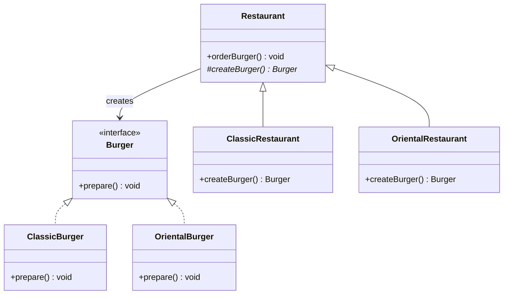

# Factory Method Design Pattern

## Definition
> The **Factory Method Pattern** defines an interface for creating objects but lets subclasses decide which class to instantiate.  
> It allows a class to defer instantiation to its subclasses.

---

## ✅ Key Characteristics
- Defines a **common interface** for product creation.  
- Subclasses decide **which concrete product** to instantiate.  
- Promotes **loose coupling** between client code and concrete classes.  
- Supports the **Open/Closed Principle** (easy to add new product types).  
- Often used alongside the **Template Method Pattern** (factory method is the "hook").  

---

## ❌ Problem Without Factory Method
```java
public class Restaurant {
    public void orderBurger(String type) {
        if (type.equals("Classic")) {
            Burger burger = new ClassicBurger();
            burger.prepare();
        } else if (type.equals("Oriental")) {
            Burger burger = new OrientalBurger();
            burger.prepare();
        }
    }
}
```
### 🚨 Problem
- The `Restaurant` class is tightly coupled to `ClassicBurger` and `OrientalBurger`.  
- Adding a new burger requires modifying `Restaurant` (violating Open/Closed Principle).  

---

## ✅ Factory Method Solution

### Product Interface
```java
public interface Burger {
    void prepare();
}
```

### Concrete Products
```java
public class ClassicBurger implements Burger {
    @Override
    public void prepare() {
        System.out.println("Preparing Classic Burger...");
    }
}

public class OrientalBurger implements Burger {
    @Override
    public void prepare() {
        System.out.println("Preparing Oriental Burger...");
    }
}
```

### Creator (Abstract)
```java
public abstract class Restaurant {
    public void orderBurger() {
        System.out.println("Ordering Burger...");
        Burger burger = createBurger();  // Factory Method
        burger.prepare();
    }

    protected abstract Burger createBurger();
}
```

### Concrete Creators
```java
public class ClassicRestaurant extends Restaurant {
    @Override
    protected Burger createBurger() {
        System.out.println("Creating Classic Burger...");
        return new ClassicBurger();
    }
}

public class OrientalRestaurant extends Restaurant {
    @Override
    protected Burger createBurger() {
        System.out.println("Creating Oriental Burger...");
        return new OrientalBurger();
    }
}
```

### Client Usage
```java
public class App {
    public static void main(String[] args) {
        Restaurant classic = new ClassicRestaurant();
        classic.orderBurger();

        Restaurant oriental = new OrientalRestaurant();
        oriental.orderBurger();
    }
}
```

**Output**
```
Ordering Burger...
Creating Classic Burger...
Preparing Classic Burger...
Ordering Burger...
Creating Oriental Burger...
Preparing Oriental Burger...
```

---

## 🔎 Explanation
- `Restaurant` defines the **factory method** `createBurger()`.  
- Subclasses (`ClassicRestaurant`, `OrientalRestaurant`) decide **which burger** to create.  
- `orderBurger()` defines the general workflow (ordering, preparing), while allowing subclasses to vary the creation step.  
- This eliminates `if-else` chains and improves extensibility.  

---

## 🎯 When to Use
- When a class needs to delegate instantiation to subclasses.  
- When you expect to add new product types in the future.  
- When object creation logic should not be hardcoded in the client.  

---

## UML Class Diagram


---

✅ The **Factory Method Pattern** delegates product creation to subclasses, promoting flexibility, scalability, and adherence to SOLID principles.
