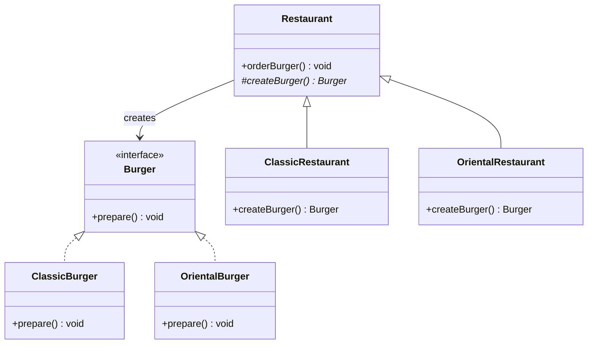

# Factory Method (Creational)

## Intent
Define an interface for creating an object, but let subclasses decide which class to instantiate.  
Factory Method lets a class defer instantiation to subclasses.

---

## When to Use
- You need to create objects but want subclasses to choose **which** concrete type.
- You want to move construction logic out of the client to reduce coupling.
- You anticipate adding new product types without modifying existing client code.

---

## Participants
- **Product** – the interface/abstract type created by the factory (`Burger`)
- **ConcreteProduct** – concrete implementations (`ClassicBurger`, `OrientalBurger`)
- **Creator** – declares the factory method (`Restaurant#createBurger`)
- **ConcreteCreator** – overrides the factory method to return a concrete product (`ClassicRestaurant`, `OrientalRestaurant`)

---

## UML (Mermaid)



---

## Problem (Motivation)
A restaurant system must produce different burger types. If client code uses `new` directly, every new burger variant forces client changes. We want to isolate **creation** so adding new burgers won’t ripple through the codebase.

---

## Solution (Factory Method)

> The creator (`Restaurant`) defines a **factory method** `createBurger()` that returns a `Burger`. Subclasses decide the concrete `Burger` to create.

### Product Interface

```java
public interface Burger {
    void prepare();
}
```

### Concrete Products

```java
public class ClassicBurger implements Burger {
    @Override
    public void prepare() {
        System.out.println("Preparing Classic Burger...");
    }
}

public class OrientalBurger implements Burger {
    @Override
    public void prepare() {
        System.out.println("Preparing Oriental Burger...");
    }
}
```

### Creator (defines the factory method)

```java
public abstract class Restaurant {

    public void orderBurger() {
        System.out.println("Ordering Burger...");
        Burger burger = createBurger(); // Factory Method
        burger.prepare();
    }

    protected abstract Burger createBurger();
}
```

### Concrete Creators (choose the product)

```java
public class ClassicRestaurant extends Restaurant {
    @Override
    protected Burger createBurger() {
        System.out.println("Creating Classic Burger...");
        return new ClassicBurger();
    }
}

public class OrientalRestaurant extends Restaurant {
    @Override
    protected Burger createBurger() {
        System.out.println("Creating Oriental Burger...");
        return new OrientalBurger();
    }
}
```

### Client Usage

```java
public class App {
    public static void main(String[] args) {
        Restaurant classic = new ClassicRestaurant();
        classic.orderBurger();

        Restaurant oriental = new OrientalRestaurant();
        oriental.orderBurger();
    }
}
```

**Output**
```
Ordering Burger...
Creating Classic Burger...
Preparing Classic Burger...
Ordering Burger...
Creating Oriental Burger...
Preparing Oriental Burger...
```

---

## Consequences

### Benefits
- **Open/Closed Principle**: add new `Burger` types by introducing new `Restaurant` subclasses—no changes in client flow.
- **Single Responsibility**: construction logic lives in creators; business flow (`orderBurger`) stays stable.
- **Decoupling**: clients depend on the `Burger` interface, not concrete classes.

### Trade-offs
- **More classes**: each variant needs a new concrete creator.
- **Indirection**: object creation path is less obvious than `new`.

---

## Implementation Notes
- Keep factory method **protected** when only creators should call it; **public** if external callers may need to trigger creation.
- You can pass **parameters** to the factory method if variations require data.
- If your “creator” needs to switch among many products based on a parameter, consider **Simple Factory** first; migrate to Factory Method when subclassing brings clarity/extensibility.

---

## Real-World Analogies
- **Framework hooks**: A template method (`orderBurger`) calls a factory method (`createBurger`). Subclasses plug their specifics.
- **Web controllers**: Base controller defines a method to build a response; specialized controllers override how the response is created.

---

## Comparison
- **Simple Factory**: one object decides which class to instantiate (no inheritance required).  
- **Factory Method**: subclasses decide which class to instantiate (uses inheritance).  
- **Abstract Factory**: creates **families** of related objects.

---

## Checklist
- [x] Define `Product` interface (`Burger`).
- [x] Create concrete products (`ClassicBurger`, `OrientalBurger`).
- [x] Define `Creator` with a factory method (`Restaurant#createBurger`).
- [x] Implement concrete creators (`ClassicRestaurant`, `OrientalRestaurant`).
- [x] Use `orderBurger()` to encapsulate the flow; `createBurger()` to vary the product.

---

## Extending This Example
- Add `CheeseBurger`, `VeganBurger` with matching `Restaurant` subclasses.
- Add a `deliver()` step in `orderBurger()` to demonstrate fixed pipeline + variable creation.
- Replace `System.out` prints with logging; or integrate persistence at service layers.

---
