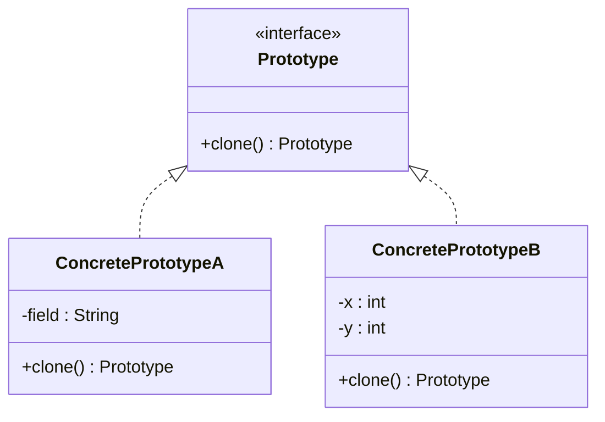

# Prototype Design Pattern

## Definition
> The **Prototype Pattern** creates new objects by **cloning** existing instances, avoiding costly initialization and enabling runtime configuration by copying.

---

## ✅ Key Characteristics
- Create objects via **clone**, not `new`.  
- Useful when initialization is **expensive** or **stateful**.  
- Enables a **prototype registry** for preconfigured instances.  
- Decide between **shallow** vs **deep** copies based on fields.

---

## ❌ Problem Without Prototype
Creating complex objects from scratch is expensive; you need multiple similar variants at runtime.

---

## ✅ Prototype Solution

### Prototype Interface
```java
public interface Prototype<T> extends Cloneable {
    T clone();
}
```

### Concrete Prototypes
```java
public class Shape implements Prototype<Shape> {
    private String color;
    public Shape(String color){ this.color = color; }
    public String getColor(){ return color; }
    @Override
    public Shape clone() { return new Shape(this.color); }
}

public class Point implements Prototype<Point> {
    private int x, y;
    public Point(int x, int y){ this.x = x; this.y = y; }
    public int getX(){ return x; } public int getY(){ return y; }
    @Override
    public Point clone(){ return new Point(x, y); }
}
```

### Client
```java
public class App {
    public static void main(String[] args) {
        Shape red = new Shape("red");
        Shape redCopy = red.clone();
        System.out.println("Original: " + red.getColor());
        System.out.println("Copy: " + redCopy.getColor());
    }
}
```

---

## 🔎 Explanation
- Cloning **avoids re-running** heavy constructors.  
- For nested mutable fields, implement **deep copy** in `clone()`.

---

## 🎯 When to Use
- Object creation is **expensive**, **complex**, or **stateful**.  
- You need many similar objects at runtime with small differences.  

---

## UML Class Diagram

---

✅ The **Prototype Pattern** lets you duplicate configured objects safely and efficiently.
