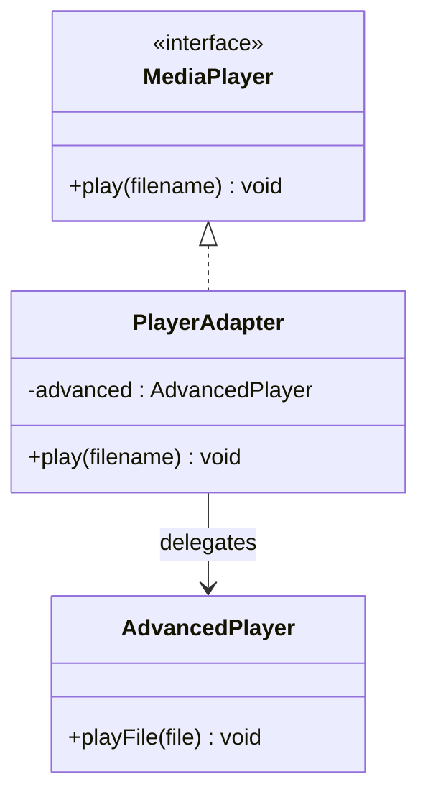

# Adapter Design Pattern

## Definition
> The **Adapter Pattern** converts the interface of a class into another interface clients expect. It lets classes work together that couldn’t otherwise because of incompatible interfaces.

---

## ✅ Key Characteristics
- Translates one interface to another **without changing existing code**.  
- Often used to integrate **legacy or third-party code**.  
- Preserves **Single Responsibility** by isolating conversion logic.  

---

## ❌ Problem Without Adapter
You have a `MediaPlayer` expecting `play(String filename)` but a new library exposes `playFile(File file)`. Direct usage breaks the client’s expectations.

---

## ✅ Adapter Solution

### Target Interface
```java
public interface MediaPlayer {
    void play(String filename);
}
```

### Adaptee (incompatible API)
```java
public class AdvancedPlayer {
    public void playFile(java.io.File file) {
        System.out.println("Playing file: " + file.getName());
    }
}
```

### Adapter
```java
public class PlayerAdapter implements MediaPlayer {
    private final AdvancedPlayer advanced = new AdvancedPlayer();
    @Override
    public void play(String filename) {
        advanced.playFile(new java.io.File(filename));
    }
}
```

### Client
```java
public class App {
    public static void main(String[] args) {
        MediaPlayer player = new PlayerAdapter();
        player.play("song.mp3");
    }
}
```

---

## 🔎 Explanation
- `PlayerAdapter` maps `String` to `File` and delegates work to `AdvancedPlayer`.  
- Client code remains unchanged while adopting a new API.  

---

## 🎯 When to Use
- Integrating **incompatible interfaces**.  
- Migrating from **legacy systems**.  
- Reusing existing classes without modifying them.  

---

## UML Class Diagram

---

✅ The **Adapter Pattern** enables smooth integration by translating interfaces without altering existing client code.
