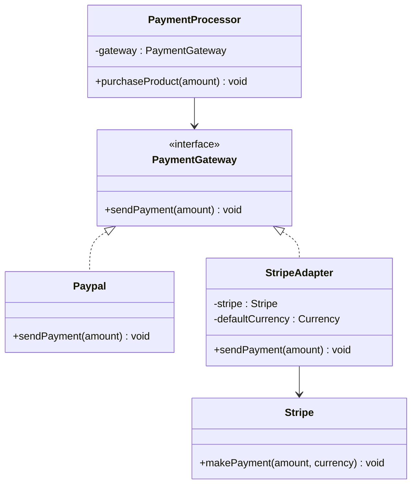

# Adapter Design Pattern

## Definition
> The **Adapter Pattern** converts the interface of a class into another interface clients expect.  
> It allows incompatible classes to work together by acting as a translator.

---

## ✅ Key Characteristics
- Provides a **bridge** between incompatible interfaces.
- Allows reusing existing classes without changing their source code.
- Keeps client code independent of vendor/third-party APIs.
- Adheres to the **Open/Closed Principle** — new adapters can be introduced without changing client code.

---

## ❌ Problem Without Adapter
- A `PaymentProcessor` expects a `PaymentGateway` interface (`sendPayment(int amount)`),  
  but a third-party SDK (like **Stripe**) exposes a different method (`makePayment(int amount, Currency currency)`).
- Without an adapter, the client can’t easily swap between providers.

---

## ✅ Adapter Solution (Payment Gateway Example in **Java**)

### Target Interface
```java
public interface PaymentGateway {
    void sendPayment(int amount);
}
```

### Client (depends on the interface, not concretes)
```java
public class PaymentProcessor {
    private final PaymentGateway gateway;

    public PaymentProcessor(PaymentGateway gateway) {
        this.gateway = gateway;
    }

    public void purchaseProduct(int amount) {
        gateway.sendPayment(amount);
    }
}
```

### Existing Implementation (already compatible)
```java
public class Paypal implements PaymentGateway {
    @Override
    public void sendPayment(int amount) {
        System.out.println(amount + " processed by PayPal");
    }
}
```

### Incompatible Class (Adaptee)
```java
import java.util.Currency;

public class Stripe {
    public void makePayment(int amount, Currency currency) {
        System.out.println(amount + " processed by Stripe" + (currency != null ? " in " + currency : ""));
    }
}
```

### Adapter
```java
import java.util.Currency;

public class StripeAdapter implements PaymentGateway {
    private final Stripe stripe;
    private final Currency defaultCurrency;

    public StripeAdapter(Stripe stripe) {
        this(stripe, Currency.getInstance("USD"));
    }

    public StripeAdapter(Stripe stripe, Currency defaultCurrency) {
        this.stripe = stripe;
        this.defaultCurrency = defaultCurrency;
    }

    @Override
    public void sendPayment(int amount) {
        stripe.makePayment(amount, defaultCurrency); // translate call + add missing context
    }
}
```

### Client Usage
```java
import java.util.Currency;

public class App {
    public static void main(String[] args) {
        // Payment using PayPal
        PaymentGateway paypal = new Paypal();
        PaymentProcessor processorPaypal = new PaymentProcessor(paypal);
        processorPaypal.purchaseProduct(45);

        // Payment using Stripe via Adapter
        Stripe stripe = new Stripe();
        PaymentGateway stripeAdapter = new StripeAdapter(stripe, Currency.getInstance("USD"));
        PaymentProcessor processorStripe = new PaymentProcessor(stripeAdapter);
        processorStripe.purchaseProduct(50);
    }
}
```

**Output (example)**
```
45 processed by PayPal
50 processed by Stripe in USD
```

---

## 🔎 Explanation
- `PaymentProcessor` depends on the **Target** interface `PaymentGateway`.
- `Paypal` matches the target already.
- `Stripe` has a **different** API (`makePayment`), so `StripeAdapter` **translates** `sendPayment` to `makePayment`, supplying a default `Currency`.
- Client code remains **unchanged** when switching providers.

---

## 🎯 When to Use
- Integrating **third-party libraries** with mismatched APIs.
- Migrating **legacy** implementations behind a unified interface.
- Providing a **stable API** while vendors change under the hood.

---

## UML Class Diagram

---

✅ The **Adapter Pattern** lets `PaymentProcessor` work with **both PayPal and Stripe**, even though their interfaces are different.
