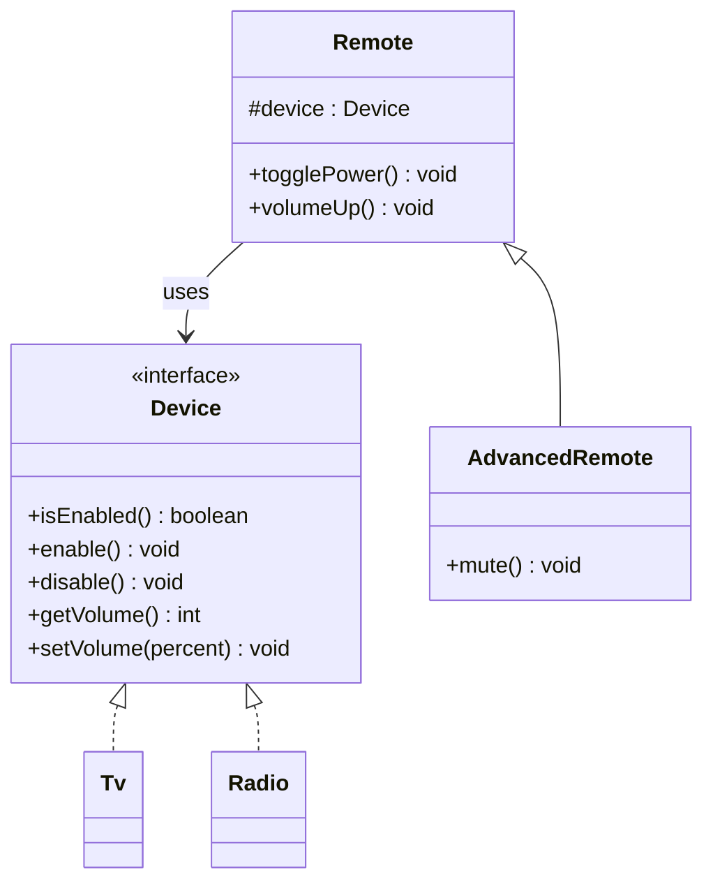

# Bridge Design Pattern

## Definition
> The **Bridge Pattern** decouples an abstraction from its implementation so that the two can vary independently.

---

## ✅ Key Characteristics
- Splits hierarchy into **Abstraction** and **Implementation**.  
- Reduces class explosion versus deep inheritance trees.  
- Enables **runtime switching** of implementations.  

---

## ❌ Problem Without Bridge
A `Remote` class with many device-specific subclasses (`TVRemote`, `RadioRemote`, etc.) grows combinatorially when adding features and devices.

---

## ✅ Bridge Solution

### Implementor
```java
public interface Device {
    boolean isEnabled();
    void enable();
    void disable();
    int getVolume();
    void setVolume(int percent);
}
```

### Concrete Implementors
```java
public class Tv implements Device {
    private boolean on; private int volume = 30;
    public boolean isEnabled(){ return on; }
    public void enable(){ on = true; }
    public void disable(){ on = false; }
    public int getVolume(){ return volume; }
    public void setVolume(int percent){ volume = percent; }
}

public class Radio implements Device {
    private boolean on; private int volume = 20;
    public boolean isEnabled(){ return on; }
    public void enable(){ on = true; }
    public void disable(){ on = false; }
    public int getVolume(){ return volume; }
    public void setVolume(int percent){ volume = percent; }
}
```

### Abstraction
```java
public class Remote {
    protected final Device device;
    public Remote(Device device){ this.device = device; }
    public void togglePower(){ if(device.isEnabled()) device.disable(); else device.enable(); }
    public void volumeUp(){ device.setVolume(device.getVolume() + 10); }
}
```

### Refined Abstraction
```java
public class AdvancedRemote extends Remote {
    public AdvancedRemote(Device device){ super(device); }
    public void mute(){ device.setVolume(0); }
}
```

### Client
```java
public class App {
    public static void main(String[] args) {
        Device tv = new Tv();
        Remote remote = new AdvancedRemote(tv);
        remote.togglePower();
        remote.volumeUp();
    }
}
```

---

## 🔎 Explanation
- Abstraction (`Remote`) works with `Device` interface, not concrete devices.  
- You can add new **devices** or new **remotes** independently.  

---

## 🎯 When to Use
- Avoiding **class explosion** from multiple dimensions of variation.  
- You need to switch implementations **at runtime**.  

---

## UML Class Diagram

---

✅ The **Bridge Pattern** separates concerns and keeps hierarchies manageable.
