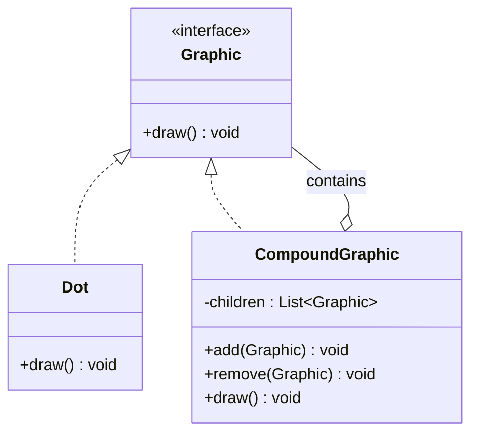

# Composite Design Pattern

## Definition
> The **Composite Pattern** composes objects into tree structures to represent part-whole hierarchies. It lets clients treat individual objects and compositions uniformly.

---

## ✅ Key Characteristics
- Represents **trees** of objects (components and composites).  
- Uniform treatment via a **common interface**.  
- Great for UI hierarchies, file systems, and document models.  

---

## ❌ Problem Without Composite
Operations must distinguish between single objects and containers, resulting in complex conditionals and fragile code.

---

## ✅ Composite Solution

### Component
```java
public interface Graphic {
    void draw();
}
```

### Leaf
```java
public class Dot implements Graphic {
    private final int x, y;
    public Dot(int x, int y){ this.x = x; this.y = y; }
    public void draw(){ System.out.println("Draw Dot at (" + x + "," + y + ")"); }
}
```

### Composite
```java
import java.util.ArrayList;
import java.util.List;

public class CompoundGraphic implements Graphic {
    private final List<Graphic> children = new ArrayList<>();
    public void add(Graphic child){ children.add(child); }
    public void remove(Graphic child){ children.remove(child); }
    public void draw(){ children.forEach(Graphic::draw); }
}
```

### Client
```java
public class App {
    public static void main(String[] args) {
        CompoundGraphic picture = new CompoundGraphic();
        picture.add(new Dot(1,1));
        picture.add(new Dot(2,2));
        picture.draw();
    }
}
```

---

## 🔎 Explanation
- Composite forwards calls to children; leaves handle the operation directly.  
- Clients use `Graphic` uniformly, whether it’s a single `Dot` or a `CompoundGraphic`.  

---

## 🎯 When to Use
- Hierarchical structures (files, GUI, org charts).  
- Need to treat **part and whole** uniformly.  

---

## UML Class Diagram

---

✅ The **Composite Pattern** simplifies tree-like structures with a uniform interface.
