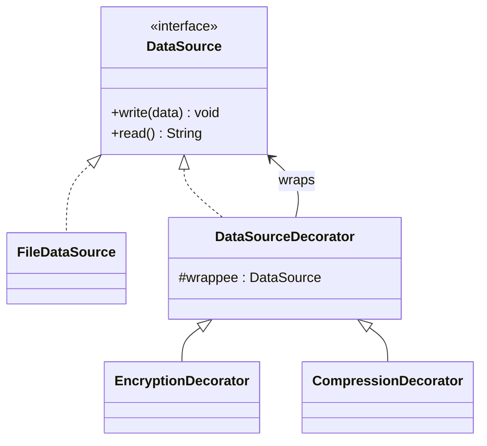

# Decorator Design Pattern

## Definition
> The **Decorator Pattern** attaches additional responsibilities to an object dynamically. Decorators provide a flexible alternative to subclassing for extending functionality.

---

## ✅ Key Characteristics
- Wraps objects to **add behavior** at runtime.  
- Preserves original interface, enabling **transparent usage**.  
- Supports many combinations without subclass explosion.  

---

## ❌ Problem Without Decorator
Adding features via inheritance leads to class explosion and inflexibility (e.g., `BufferedEncryptedInputStream` etc.).

---

## ✅ Decorator Solution

### Component
```java
public interface DataSource {
    void write(String data);
    String read();
}
```

### Concrete Component
```java
public class FileDataSource implements DataSource {
    private final StringBuilder store = new StringBuilder();
    public void write(String data){ store.append(data); }
    public String read(){ return store.toString(); }
}
```

### Base Decorator
```java
public abstract class DataSourceDecorator implements DataSource {
    protected final DataSource wrappee;
    protected DataSourceDecorator(DataSource source){ this.wrappee = source; }
    public void write(String data){ wrappee.write(data); }
    public String read(){ return wrappee.read(); }
}
```

### Concrete Decorators
```java
public class EncryptionDecorator extends DataSourceDecorator {
    public EncryptionDecorator(DataSource source){ super(source); }
    public void write(String data){ super.write("[enc]" + data); }
}

public class CompressionDecorator extends DataSourceDecorator {
    public CompressionDecorator(DataSource source){ super(source); }
    public void write(String data){ super.write("[zip]" + data); }
}
```

### Client
```java
public class App {
    public static void main(String[] args) {
        DataSource source = new FileDataSource();
        DataSource decorated = new EncryptionDecorator(new CompressionDecorator(source));
        decorated.write("Hello");
        System.out.println(source.read()); // [enc][zip]Hello
    }
}
```

---

## 🔎 Explanation
- Decorators add behavior before/after delegating to the wrapped object.  
- You can **stack** decorators to combine behaviors.  

---

## 🎯 When to Use
- Add cross-cutting features (caching, logging, compression, encryption).  
- Avoid deep inheritance just to add behavior variants.  

---

## UML Class Diagram

---

✅ The **Decorator Pattern** lets you add features flexibly, one wrapper at a time.
