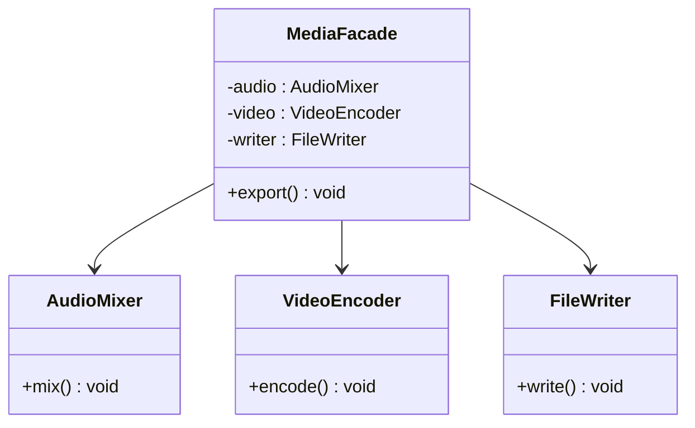

# Facade Design Pattern

## Definition
> The **Facade Pattern** provides a unified, high-level interface to a set of interfaces in a subsystem, making it easier to use.

---

## ✅ Key Characteristics
- Simplifies complex subsystems with a **single entry point**.  
- Shields clients from subsystem details and reduces coupling.  
- Can provide **sensible defaults** and ordering of operations.  

---

## ❌ Problem Without Facade
Clients must orchestrate many classes in the right order, increasing the chance of misuse.

---

## ✅ Facade Solution
```java
class AudioMixer { void mix(){} }
class VideoEncoder { void encode(){} }
class FileWriter { void write(){ System.out.println("Written output file."); } }

public class MediaFacade {
    private final AudioMixer audio = new AudioMixer();
    private final VideoEncoder video = new VideoEncoder();
    private final FileWriter writer = new FileWriter();
    public void export() {
        audio.mix();
        video.encode();
        writer.write();
    }
}

public class App {
    public static void main(String[] args) {
        new MediaFacade().export();
    }
}
```

---

## 🔎 Explanation
- `MediaFacade` sequences subsystem calls correctly.  
- Clients call one simple method and ignore subsystem complexity.  

---

## 🎯 When to Use
- Complex subsystems (multimedia, network stacks, compiler pipelines).  
- Provide a **safe default** workflow for common tasks.  

---

## UML Class Diagram

---

✅ The **Facade Pattern** offers a friendly API over a complex subsystem.
