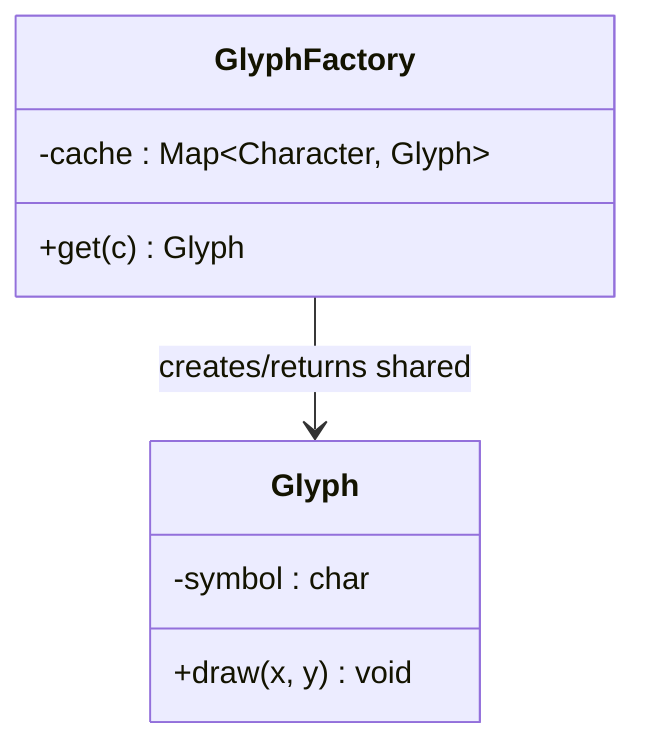

# Flyweight Design Pattern

## Definition
> The **Flyweight Pattern** reduces memory usage by sharing common, immutable state between many objects; only the extrinsic state is stored per-object.

---

## ✅ Key Characteristics
- Shares **intrinsic** (immutable) data across objects.  
- Stores **extrinsic** state outside the flyweight.  
- Dramatically reduces memory for large numbers of similar objects.  

---

## ❌ Problem Without Flyweight
Rendering millions of characters or map tiles each holding identical formatting/state leads to excessive memory usage.

---

## ✅ Flyweight Solution

### Flyweight
```java
public class Glyph {
    private final char symbol; // intrinsic
    public Glyph(char symbol){ this.symbol = symbol; }
    public void draw(int x, int y){ // extrinsic provided by client
        System.out.println("Draw '" + symbol + "' at (" + x + "," + y + ")");
    }
}
```

### Flyweight Factory
```java
import java.util.HashMap;
import java.util.Map;

public class GlyphFactory {
    private final Map<Character, Glyph> cache = new HashMap<>();
    public Glyph get(char c) {
        return cache.computeIfAbsent(c, Glyph::new);
    }
}
```

### Client
```java
public class App {
    public static void main(String[] args) {
        GlyphFactory factory = new GlyphFactory();
        Glyph a = factory.get('A');
        for (int i=0; i<3; i++) a.draw(i, i+1);
    }
}
```

---

## 🔎 Explanation
- `Glyph` stores only **intrinsic** data (`symbol`); position is **extrinsic** and supplied per-use.  
- Factory returns **shared instances** keyed by `char`.  

---

## 🎯 When to Use
- Large object graphs where many instances share identical data.  
- Text rendering, game sprites, map tiles, particles.  

---

## UML Class Diagram

---

✅ The **Flyweight Pattern** trades indirection for significant memory savings.
