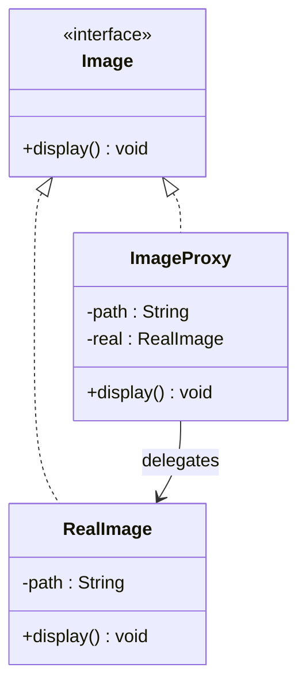

# Proxy Design Pattern

## Definition
> The **Proxy Pattern** provides a surrogate or placeholder for another object to control access to it.

---

## ✅ Key Characteristics
- Controls access (remote, virtual, protection, caching, logging).  
- Same interface as the real subject; clients are unaware.  
- Can defer creation or add cross-cutting concerns.  

---

## ❌ Problem Without Proxy
Direct access to resource-heavy or remote objects causes performance or security issues; cross-cutting concerns leak into clients.

---

## ✅ Proxy Solution

### Subject
```java
public interface Image {
    void display();
}
```

### Real Subject
```java
public class RealImage implements Image {
    private final String path;
    public RealImage(String path){ this.path = path; loadFromDisk(); }
    private void loadFromDisk(){ System.out.println("Loading " + path); }
    public void display(){ System.out.println("Displaying " + path); }
}
```

### Proxy
```java
public class ImageProxy implements Image {
    private final String path;
    private RealImage real;
    public ImageProxy(String path){ this.path = path; }
    public void display(){
        if (real == null) real = new RealImage(path); // lazy load
        real.display();
    }
}
```

### Client
```java
public class App {
    public static void main(String[] args) {
        Image img = new ImageProxy("photo.png");
        img.display(); // loads then displays
        img.display(); // cached display
    }
}
```

---

## 🔎 Explanation
- Proxy postpones heavy `RealImage` creation until needed and can add caching/security.  
- Client uses `Image` interface; does not care if it’s a proxy or real object.  

---

## 🎯 When to Use
- **Virtual** proxy (lazy creation), **Remote** proxy, **Protection** proxy, **Caching** proxy.  

---

## UML Class Diagram

---

✅ The **Proxy Pattern** adds control over access while keeping the same interface.
