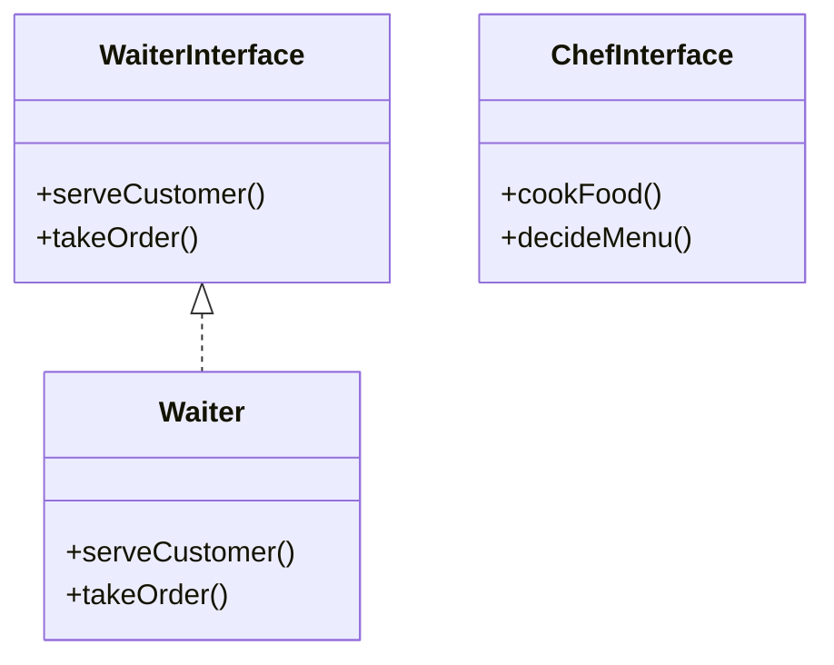

# Interface Segregation Principle (ISP)

## Definition
> Clients should not be forced to implement interfaces they do not use.  
> Instead of one large, general-purpose interface, many smaller, specific interfaces are preferred.

---

## ❌ Original Implementation (ISP Violation)

```java
interface RestaurantEmployee {
    void washDishes();
    void serveCustomer();
    void cookFood();
}

class Waiter implements RestaurantEmployee {
    public void washDishes() {
        // ❌ Not needed for waiter
    }

    public void serveCustomer() {
        System.out.println("Serving the customer");
    }

    public void cookFood() {
        // ❌ Not needed for waiter
    }
}
```

### 🚨 Problem
- `Waiter` is **forced** to implement `washDishes()` and `cookFood()`, which it does not need.  
- This violates the **Interface Segregation Principle**.

---

## ✅ Refactored Implementation (ISP Applied)

### Separate Interfaces by Role
```java
interface WaiterInterface {
    void serveCustomer();
    void takeOrder();
}

interface ChefInterface {
    void cookFood();
    void decideMenu();
}
```

### Implement Only What’s Needed
```java
class Waiter implements WaiterInterface {
    public void serveCustomer() {
        System.out.println("Serving the customer");
    }

    public void takeOrder() {
        System.out.println("Taking order from the customer");
    }
}
```

---

## 🎯 Benefits
- `Waiter` implements only waiter-specific methods.  
- `Chef` (if added) would only implement chef-specific methods.  
- Clients depend **only on what they need**, avoiding unnecessary methods.  

---

## UML Class Diagram


---

✅ This design follows the **Interface Segregation Principle (ISP)** by ensuring classes only implement methods that are relevant to their role.
