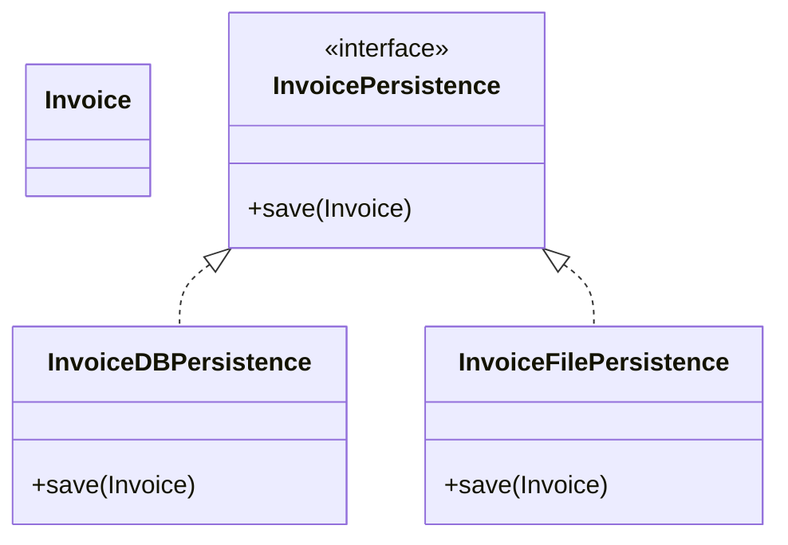

# Open/Closed Principle (OCP)

## Definition
> A class should be open for extension but closed for modification.

---

## ❌ Original Implementation (OCP Violation)

```java
class InvoiceDao {
    private Invoice invoice;

    public InvoiceDao(Invoice invoice) {
        this.invoice = invoice;
    }

    public void saveToDB(Invoice invoice) {
        // Code to save invoice to database
    }
}
```

### Adding a New Feature (Violation)
```java
class InvoiceDao {
    private Invoice invoice;

    public InvoiceDao(Invoice invoice) {
        this.invoice = invoice;
    }

    public void saveToDB(Invoice invoice) {
        // Code to save invoice to database
    }

    public void saveToFile(Invoice invoice) {
        // Code to save invoice to file
    }
}
```

### 🚨 Problem
- To add a new persistence method, we **modified** the `InvoiceDao` class.  
- This breaks the **Open/Closed Principle** because existing, tested, and deployed code should not require changes for new features.

---

## ✅ Refactored Implementation (OCP Applied)

### `InvoicePersistence` Interface
```java
interface InvoicePersistence {
    void save(Invoice invoice);
}
```

### Database Persistence
```java
class InvoiceDBPersistence implements InvoicePersistence {
    public void save(Invoice invoice) {
        // Code to save invoice to database
    }
}
```

### File Persistence
```java
class InvoiceFilePersistence implements InvoicePersistence {
    public void save(Invoice invoice) {
        // Code to save invoice to file
    }
}
```

---

## 🎯 Benefits
- The system is **closed for modification** (no changes in existing classes).  
- It is **open for extension** (new persistence strategies can be added by creating new classes).  
- Avoids risk of breaking existing tested code.

---

## UML Class Diagram


---

✅ This design follows the **Open/Closed Principle (OCP)** by allowing extensions without modifying existing code.
