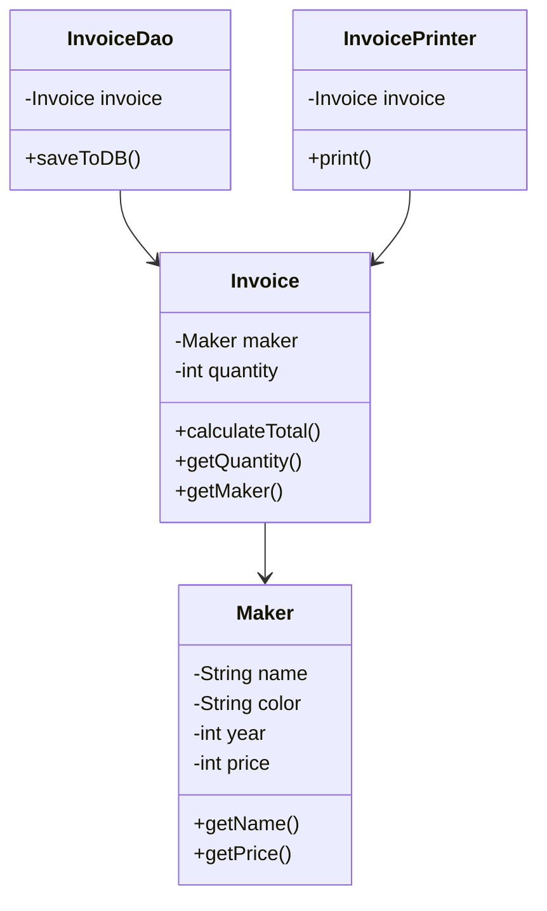

# Single Responsibility Principle (SRP)

## Definition
> A class should have only one reason to change, meaning it should have only one job or responsibility.

---

## ❌ Original Implementation (SRP Violation)

```java
class Maker {
    private String name;
    private String color;
    private int year;
    private int price;

    public Maker(String name, String color, int year, int price) {
        this.name = name;
        this.color = color;
        this.year = year;
        this.price = price;
    }

    public String getName() {
        return name;
    }

    public int getPrice() {
        return price;
    }
}

class Invoice {
    private Maker maker;
    private int quantity;

    public Invoice(Maker maker, int quantity) {
        this.maker = maker;
        this.quantity = quantity;
    }

    public int calculateTotal() {
        return maker.getPrice() * quantity;
    }

    public void printInvoice() {
        System.out.println("Invoice for " + quantity + " units of " + maker.getName());
        System.out.println("Total: $" + calculateTotal());
    }

    public void saveToDB() {
        // Code to save invoice to database
    }
}
```

### 🚨 Problems
- **`calculateTotal()`** → Business calculation.  
- **`printInvoice()`** → Presentation logic.  
- **`saveToDB()`** → Persistence logic.  

All mixed in one class → multiple reasons to change → **violates SRP**.

---

## ✅ Refactored Implementation (SRP Applied)

### `Invoice` – Only holds data & calculations
```java
class Invoice {
    private Maker maker;
    private int quantity;

    public Invoice(Maker maker, int quantity) {
        this.maker = maker;
        this.quantity = quantity;
    }

    public int calculateTotal() {
        return maker.getPrice() * quantity;
    }

    public int getQuantity() {
        return quantity;
    }

    public Maker getMaker() {
        return maker;
    }
}
```

---

### `InvoiceDao` – Handles persistence
```java
class InvoiceDao {
    private Invoice invoice;

    public InvoiceDao(Invoice invoice) {
        this.invoice = invoice;
    }

    public void saveToDB() {
        // Code to save invoice to database
    }
}
```

---

### `InvoicePrinter` – Handles presentation
```java
class InvoicePrinter {
    private Invoice invoice;

    public InvoicePrinter(Invoice invoice) {
        this.invoice = invoice;
    }

    public void print() {
        System.out.println("Invoice for " + invoice.getQuantity() 
            + " units of " + invoice.getMaker().getName());
        System.out.println("Total: $" + invoice.calculateTotal());
    }
}
```

---

## 🎯 Benefits
- **Invoice**: Only handles invoice data + total calculation.  
- **InvoiceDao**: Only handles saving to DB.  
- **InvoicePrinter**: Only handles printing.  

👉 Each class has **one responsibility** and **one reason to change**.

---

## UML Class Diagram



---

✅ Now the design fully follows the **Single Responsibility Principle (SRP)**.  
This makes the system easier to maintain, extend, and test.
